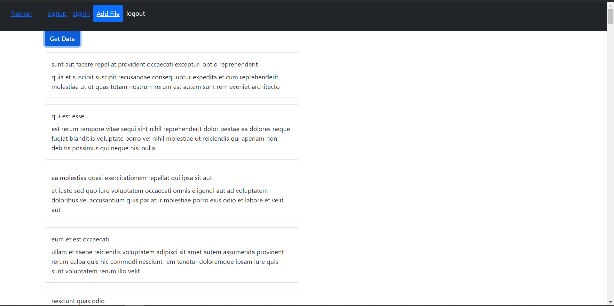

# JSON file upload

In this project user can upload json file to the DB and can check the details of it.

## Prerequisites

- Nodejs
- mongodb (locally installed, if not change the connection string in `server.js` file)
- Code editor
- Terminal (if windows prefer bash)

## Steps to run the project

1. Step 1
   - clone the project into your local device, by running the below command
     ```
     git clone <repo url>
     ```
2. Step 2
   - After cloning the project, navigate to the directory and run the below command
     ```
     npm install
     ```
     by running the above command it will install necessary dependencies.
   - Next, run the below command to start the backend server.
     ```
     npm start
     ```
3. Step 3
   - Now navigate to `/frontend` folder in the directory you just cloned and run the below command, do this step in seperate terminal
     ```
     npm install
     ```
   - Next, run the below command after running the above command
     ```
     npm start
     ```

## Screens

SignIn screen


Signup screen


Home screen


AddFile screen


## Note

- If you don't have mongodb installed locally, then please change the `uri` string in `server.js` file to mongodb atlas uri.
